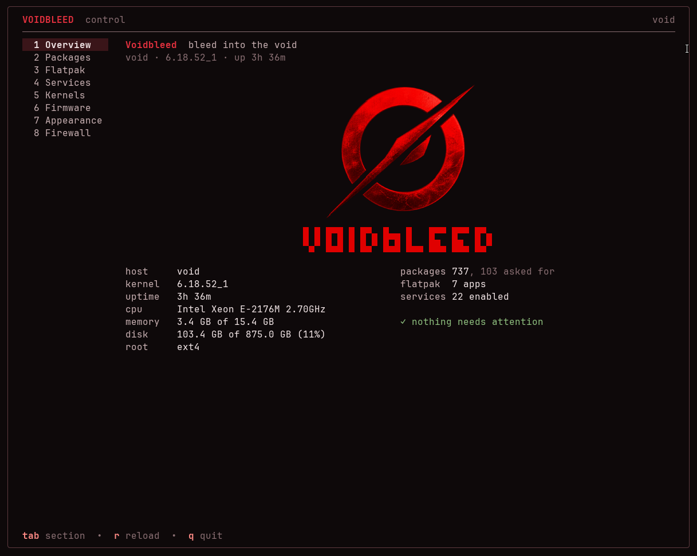

<div align="center">


# voidbleed-control

**One terminal interface for the things a Void machine otherwise needs a page of remembered commands for.**




</div>

## Install

```sh
sudo xbps-install -S --repository=https://void.7mm.ir/current voidbleed-control
```

xbps will show the repository's signing key the first time and ask whether to
trust it — it is `3e:24:c6:9c:fb:c2:56:c5:71:fb:8e:fb:a9:08:87:56`.

To keep the repository around for updates:

```sh
echo 'repository=https://void.7mm.ir/current' | sudo tee /etc/xbps.d/voidbleed.conf
```

Then `voidbleed-control`. Run it as yourself: anything that changes the machine
asks for the administrator password when it needs one. `voidbleed-control
--demo` drives the whole interface from canned data and changes nothing.

## What it does

| Section | |
|---|---|
| **Overview** | the machine at a glance — kernel, uptime, memory, disk — and what wants doing, each with the keys that do it |
| **Packages** | installed, waiting updates, orphans and repository search in one list, with xbps's own description beside it; install, remove, keep, update, sync, clean |
| **Flatpak** | applications and runtimes, updates, Flathub search, prune what nothing uses |
| **Services** | every runit service and what it is, enabled or not, with live state; enable, disable, start, stop, restart |
| **Kernels** | which series are installed and which one booted, install another one alongside, and clear the trees left in /boot |
| **Snapshots** | btrfs snapshots of the root subvolume — only on a machine with a btrfs root |
| **Firmware** | fwupd devices and the updates waiting for them, with the version spelled out before anything is written |
| **Appearance** | GTK, Qt, icons, cursor and fonts set together, written to gsettings *and* the toolkit files |
| **Firewall** | ufw: on or off, default policy, and the rule list |

It only shows what a machine can actually use: the snapshots section appears on
a btrfs root, the firmware section says so when fwupd is absent, and the
firewall section reports iptables or nftables rather than aiming ufw commands
at something that is not ufw.

## How it behaves

**Reading is unprivileged.** Listing packages, services, kernels and firmware
needs no password; the update check uses xbps's in-memory sync so it does not
write to `/var/db/xbps` either.

**Anything that changes the machine names itself**, asks for the sudo password
once — held in memory, for as long as the program runs — and streams its output
where you can watch it. Removals, firmware writes and firewall changes ask
first, and say what they are about to do:

```
Write firmware 1.31.0 to System Firmware?
Keep the machine powered until it finishes.
```

**Nothing is done behind your back.** The overview describes the machine and
tells you which keys deal with what it flags; it never changes anything itself.

## The logo

In Ghostty, Kitty or WezTerm the mark is the real picture, handed to the
terminal through Kitty's graphics protocol and drawn as Unicode placeholder
cells — ordinary text in the frame, so nothing moves the cursor behind the
renderer's back. Everywhere else it falls back to block art, and to ASCII on a
Linux console. `VOIDBLEED_GRAPHICS=0` (or `--no-graphics`) forces the art.

## Build it

```sh
go build ./cmd/voidbleed-control     # needs Go 1.27
go test ./...
```

To build the package:

```sh
git clone https://github.com/void-linux/void-packages
cp -r srcpkgs/voidbleed-control void-packages/srcpkgs/
cd void-packages && ./xbps-src pkg voidbleed-control
```

## Where it comes from

This is one half of [Voidbleed](https://github.com/Borderliner/Voidbleed), a
Void Linux variant — the other half being the installer that puts it on disk.
The control centre works on any Void system, which is why it lives here on its
own.

Built on [Bubble Tea](https://github.com/charmbracelet/bubbletea) and
[Lip Gloss](https://github.com/charmbracelet/lipgloss).
